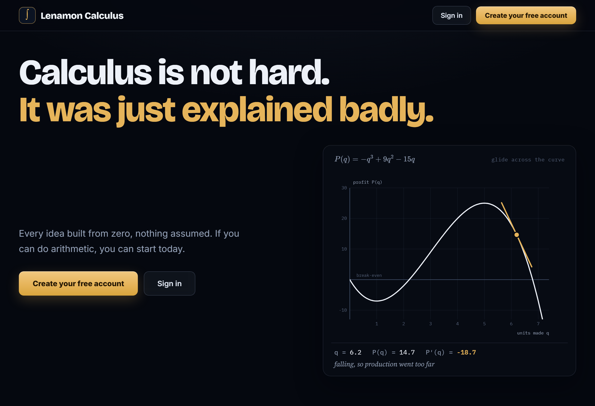
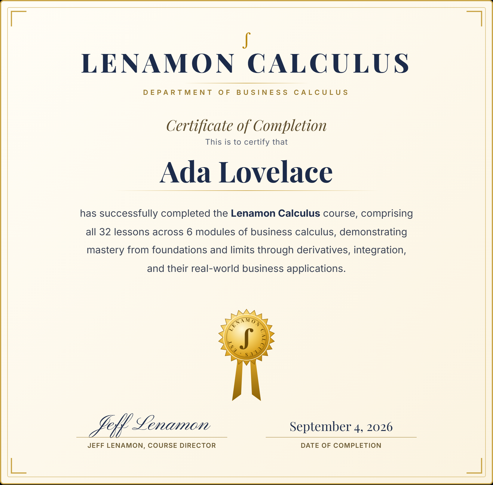

<div align="center">

# Business Calculus

### Learn business calculus from absolute zero, one honest step at a time.

A free, interactive web course that teaches **business calculus** to a complete beginner. (Business calculus is the applied, no-trigonometry flavor of calculus used in business, economics, and finance, centered on derivatives, integrals, and their real-world money applications.) Every concept is built from the ground up, and nothing is assumed. The guiding rule is simple: **never state a fact without explaining why it is true in terms the learner already understands.**

<br/>

[](https://www.anthropic.com/news/claude-fable-5-mythos-5)

[](LICENSE)
[](https://react.dev)
[](https://vite.dev)
[](https://katex.org)

[](#)
[](#contributing)
[](#getting-started)


<br/>



</div>

---

## Who this is for

If you can do basic arithmetic, you can start here. No algebra fluency is required, no prior calculus, and no "you should already know this." The reading level targets a curious 15-year-old, which means it works just as well for:

- **Students** who found a textbook that skipped a step and lost them.
- **Adults** returning to math who want the intuition, not just the recipe.
- **Business and finance learners** who need calculus for marginal analysis, optimization, elasticity, and present value.
- **Teachers** looking for worked examples that explain the *why* behind every line.

---

## What makes it different

Most courses lose beginners at the exact moment an author assumes something the student never learned. This project is built to remove those silent assumptions.

| Principle | What it means in practice |
| --- | --- |
| **Explain the why, always** | You will learn *why* you cannot divide by zero, *why* `b^0 = 1`, *why* the chain rule multiplies, and *why* an integral measures area, not just the rules themselves. |
| **No skipped steps** | Worked examples show the algebra in full, including the sign traps and the "obvious" lines that trip people up. |
| **Notation read aloud** | Every new symbol (`f'(x)`, `dy/dx`, the integral sign, limits) is named and grounded the first time it appears. |
| **Verified for accuracy** | Every number, derivative, integral, sign chart, and graph has been independently recomputed across multiple adversarial review passes. |

---

## Features

- **Knowledge-check quizzes.** Every lesson ends with a 3-question quiz drawn straight from its material, a mix of conceptual and compute-it problems. Questions appear one at a time; a wrong answer gives a friendly explanation of why that choice is wrong and lets you try again, and you must pass all three to move on. (96 questions, every answer independently verified.)
- **Interactive labs.** Drag a point along a curve and watch the tangent line and the live slope readout change. Slide a parameter and reshape a function in real time while the equation updates. Slide toward a hole and watch a limit arrive. Add Riemann rectangles under a parabola and watch the sum close in on the exact area.
- **Custom graphing engine.** A hand-built SVG renderer that breaks the curve across vertical asymptotes (no false connecting lines), shades regions between curves, draws tangent and reference lines, and keeps labels readable over any background.
- **A real completion certificate.** Finish all 32 lessons to unlock a printable certificate with your name, an engraved masthead, a golden foil seal, a signature, and the date. Print or Save as PDF is built in.
- **Inspiration on every page.** A card beside each lesson pairs the topic with either a genuine, attributed quote (Newton, Euler, Einstein, Cantor, von Neumann, and more) or a note of encouragement, all aimed at sparking a love of math.
- **Crisp math typesetting.** All formulas render with KaTeX, with a graceful fallback so a blocked CDN never freezes the page.
- **Gamified progress.** Earn XP and level up in the header, enjoy a confetti burst when you pass a lesson, and pick up exactly where you left off.
- **Accounts and saved progress.** Create a free account (first name, last name, email) and your progress is saved per learner, keyed by lesson so it survives new lessons being added. A certificate, once earned, stays earned. A lightweight admin view lists registered learners.
- **Designed to be read.** A clean three-column layout with module navigation, a focused reading column, and a sticky rail. Fully responsive down to mobile.
- **Accessible by default.** Keyboard-operable navigation, visible focus outlines, ARIA labels on icon buttons, and respect for reduced-motion preferences.

<div align="center">
  <br/>
  
  <br/>
  <sub>The certificate every learner earns after passing all 32 lesson quizzes.</sub>
</div>

---

## Curriculum

**32 lessons across 6 modules.** Each lesson is built from typed blocks: plain-English concept sections, a Key Formulas plate, fully worked examples, an optional interactive lab, two your-turn practice problems with complete step-by-step solutions, and a 3-question quiz you must pass before moving on. Every prerequisite idea gets its own lesson before it is needed: quadratics before break-even, business models before marginal analysis, tangent lines before linear approximation, Riemann sums before the definite integral.

| Module | Lessons |
| --- | --- |
| **1. Foundations** | Functions, Domain and Range - Linear Equations and Slope - Quadratics, Polynomials and Solving Equations - Business Models: Cost, Revenue, Profit and Demand - Exponential Functions and e - Logarithmic Functions |
| **2. Limits and Continuity** | Introduction to Limits - Infinite Limits and Limits at Infinity - Continuity |
| **3. Derivatives** | The Derivative (what it means) - Power Rule and Basic Rules - Tangent Lines, Linear Approximation and Differentiability - Marginal Analysis - Derivatives of e^x and ln(x) - Product and Quotient Rules - The Chain Rule - Implicit Differentiation and Related Rates - Elasticity of Demand |
| **4. Applications of Derivatives** | First Derivative Test - Second Derivative and Concavity - Absolute Extrema - Optimization |
| **5. Integration** | Antiderivatives - Substitution - Area as a Sum: Riemann Sums - The Definite Integral - Fundamental Theorem of Calculus - Integration by Parts |
| **6. Business Applications** | Area Between Curves - Average Value of a Function - Consumer and Producer Surplus - Income Streams and Present Value |

--- | --- |
| **1. Foundations** | Functions, Domain and Range - Linear Equations and Slope - Exponential Functions and e - Logarithmic Functions |
| **2. Limits and Continuity** | Introduction to Limits - Infinite Limits and Limits at Infinity - Continuity |
| **3. Derivatives** | The Derivative (what it means) - Power Rule - Marginal Analysis - Derivatives of e^x and ln(x) - Product and Quotient Rules - The Chain Rule - Elasticity of Demand |
| **4. Applications of Derivatives** | First Derivative Test - Second Derivative and Concavity - Absolute Extrema - Optimization |
| **5. Integration** | Antiderivatives - Substitution - The Definite Integral - Fundamental Theorem of Calculus |
| **6. Business Applications** | Area Between Curves - Consumer and Producer Surplus - Income Streams and Present Value |

---

## Accounts and admin

The course is gated behind a free account so progress can be saved per learner. Sign-up asks only for a first name, last name, and email; returning learners sign in by email. An admin view (reached from the landing-page footer) lists every registered learner and can edit a name or email, or remove an account.

This is a deliberately lightweight, **client-side** account system: accounts and progress live in the browser's `localStorage`, so it is not a secure authentication system. It exists to support per-learner progress and the completion certificate. A real backend with proper authentication is the planned next step.

---

## Tech stack

| Layer | Choice |
| --- | --- |
| **Framework** | React 18 (single-file app, client rendered) |
| **Build tool** | Vite 6 |
| **Math rendering** | KaTeX (loaded via CDN, with a load-timeout fallback) |
| **Typography** | Inter for body and UI, Bricolage Grotesque for display |
| **Styling** | Inline styles, dark theme with a subtle radial-gradient background |
| **Dependencies** | Just two runtime packages: `react` and `react-dom` |

---

## Getting started

### Prerequisites

- [Node.js](https://nodejs.org) 20.19 or newer (includes npm); pinned via `engines` and `.nvmrc`

### Run it locally

```bash
# 1. Clone the repository
git clone https://github.com/lenamonj/lenamon-calculus.git
cd lenamon-calculus

# 2. Install dependencies
npm install

# 3. Start the dev server
npm run dev
```

Then open the printed local URL (defaults to `http://localhost:5173`).

### Available scripts

| Command | What it does |
| --- | --- |
| `npm run dev` | Start the Vite dev server with hot reload |
| `npm run build` | Produce an optimized production build in `dist/` |
| `npm run preview` | Serve the production build locally to verify it |
| `npm test` | Run the Vitest suite (engine, accessibility, and the lesson content contract) |
| `npm run lint` | Run ESLint |

---

## Project structure

```
lenamon-calculus/
├── index.html          # App shell, KaTeX + font loading
├── src/
│   ├── main.jsx        # React entry point
│   ├── App.jsx         # The engine: graphs, labs, lesson surface, quizzes,
│   │                   #   accounts, admin, and the completion certificate
│   ├── content.jsx     # The 32 lessons and the 96-question quiz bank
│   ├── progress.js     # Saved-progress format and the v1 migration
│   └── *.test.jsx      # Vitest suites, including the content contract
├── docs/specs/         # Design notes and the curriculum spec
├── docs/plans/         # Implementation plans
├── public/             # Static assets
├── package.json
└── vite.config.js
```

Lessons are structured data in `src/content.jsx`: each lesson has a stable slug and a list of typed blocks, and cross-references between lessons resolve by slug at render time, so inserting a lesson never breaks a number. The engine in `src/App.jsx` holds the custom graphing, interactive-lab, layout, auth, and certificate components. A content-contract test enforces that every lesson has a formulas plate, a worked example, two practices, a 3-question quiz, and artifact-free prose.

---

## Contributing

Contributions are welcome. The bar for any content change is the project's core standard: **a curious 15-year-old must be able to follow it with nothing assumed and no step skipped.** If you fix a number, an explanation, or a graph, please recompute it independently and note that in your pull request.

1. Fork the repository.
2. Create a feature branch (`git checkout -b improve-lesson-x`).
3. Commit your changes and push.
4. Open a pull request describing what you changed and why.

---

## License

Released under the [MIT License](LICENSE). You are free to use, modify, and share this material, including for teaching.

---

<div align="center">

Built to prove that business calculus is not hard. It was just explained badly.

</div>
